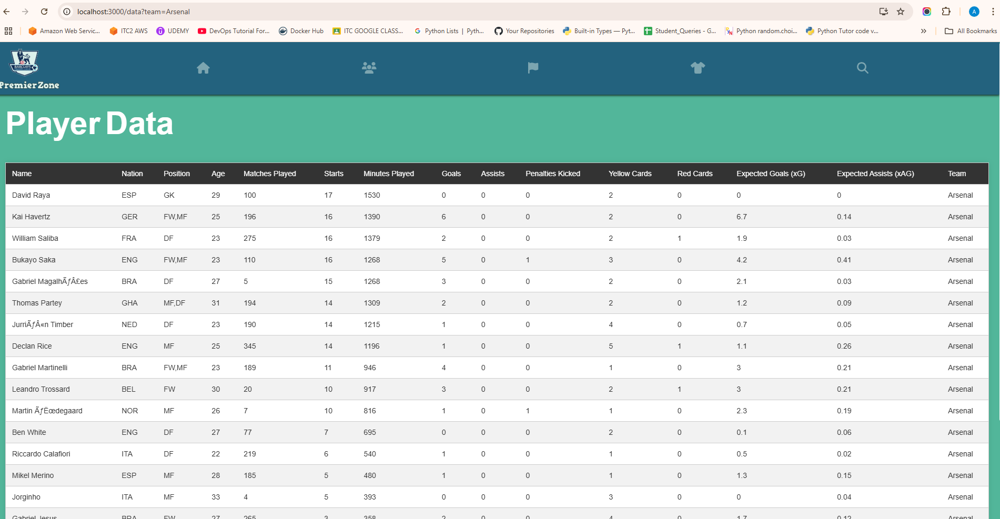

# Fantasy Player Stats Application

## Overview

### The Fantasy Player Stats Application is a full-stack project designed to scrape player data from a fantasy sports website using Python, store it in a PostgreSQL database, and display the data through a Spring Boot application. The frontend is built with React, providing users with a dynamic and responsive interface to view player statistics.

### Tech Stack
- Backend: Spring Boot (Java), PostgreSQL
- Frontend: React.js
- Scraping: Python (Beautiful Soup)
- Database: PostgreSQL

### Features
- Automated Data Scraping: Player data is scraped from fantasy sports websites using Python and Beautiful Soup.
- Database Integration: Data is inserted into a PostgreSQL database.
- REST API: Spring Boot is used to create RESTful APIs that fetch player data from the database.
- Frontend UI: A responsive React-based UI displays the player statistics in table format.
- Live Updates: New data can be scraped and inserted periodically to ensure up-to-date player stats

### Setup and Installation

#### Prerequisites
- Java 21
- PostgreSQL
- Python
- Node.js 16+

#### Running the Application
**Step 1: Clone the repository**
```bash
https://github.com/ADITYA1234556/Football-Fantasy.git
```
**Step 2: Start the backend**

**Step 3: Start the frontend**
```bash
#Navigate to Frontend
npm i #To install the modules
npm start
```

**Step 4: Access the UI**
- http://localhost:3000

<div align="center">
  <!-- Application Home Page -->
  
  <p align="center"><strong>Application Home Page</strong></p>
</div>

<div align="center">
  <!-- Players from Arsenal Team -->
  
  <p align="center"><strong>Players from Arsenal Team</strong></p>
</div>